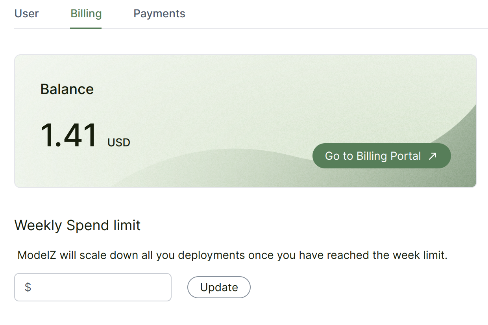

# Payments and Billing

## Billing

Modelz billing cycles are weekly. Your account balance accrues over the course of the calendar week based on the cost of the resources you use.

When you sign up, you'll receive a free credit of 1.41 USD that can be used towards your usage charges. Once you attach a payment method, we'll give you an additional 4.23 USD credit, so you can continue to explore our platform and use our services. This means you can try out our platform and take advantage of our resources without any initial investment.

You could add a credit card as a payment method for your account. We automatically invoice and charge your account’s payment method each week for the previous week's usage.

## Past due and suspended accounts

When we charge accounts, we take the following steps in this order:

- If there is a balance remaining after pre-payments, we charge the account’s default credit or debit card.
- Past due accounts. If there are no valid payment methods on file to cover an outstanding balance, the account is past due, at which point:
    - The account is marked as past due.
    - The account is no longer able to deploy new models.
    - The account’s existing resources continue to run.

    To restore a past due account, the account owner could [contact us](./community) to pay the outstanding balance and add a valid payment method.
- Suspended accounts. If an account continues to remain past due, we email the account owner and the account is suspended, at which point:
    - The account is marked as suspended.
    - The account is no longer able to deploy new models.
    - The account’s existing resources are terminated.

    To restore a suspended account, the account owner could [contact us](./community) to pay the outstanding balance and add a valid payment method.

## Billable resources

Modelz only bills for the quantity of time that your inference servers are running **and available**. We do not charge for cold starts and model loading time. There are four time periods that relate to inference:

- $cold\_start$ The time it takes to start up the inference server.
- $image\_load$ The time it takes to pull the model and load into GPU.
- $running\_time$ The time it takes to run the inference.
- $idle\_time$ The time it takes to wait for the next inference request.

We only charge for the $running\_time$ and $idle\_time$.

Let's take a look at an example. We assume that:

- $cold\_start = 10$ The inference server needs 10 seconds to start up.
- $image\_load = 10$ The inference server needs to pull a 10GB model from Huggingface Hub, which takes 10 seconds. (You could optimize it by using [**cold start optimizations**](./speedup/cold-start))

**Case 1: 1 replica**

- $running\_time = 100$ The inference server runs for 100 seconds.
- $idle\_time = 30$ The inference server remains idle for a period of 30 seconds before it is automatically scaled down.

In this case, we only charge for 130 seconds.

$running\_time + idle\_time = 130$

**Case 2: multiple replicas**

- $running\_time_{s1} = 100$ The inference server `s1` runs for 100 seconds.
- $running\_time_{s2} = 300$ The inference server `s2` runs for 300 seconds.
- $running\_time_{s3} = 500$ The inference server `s3` runs for 500 seconds.
- $idle\_time = 30$ The inference server `s1`, `s2` and `s3` remains idle for a period of 30 seconds before it is automatically scaled down.

In this case, we only charge for 990 seconds.

$running\_time_{s1} + running\_time_{s2} + running\_time_{s3} + 3 \cdot idle\_time = 990$
