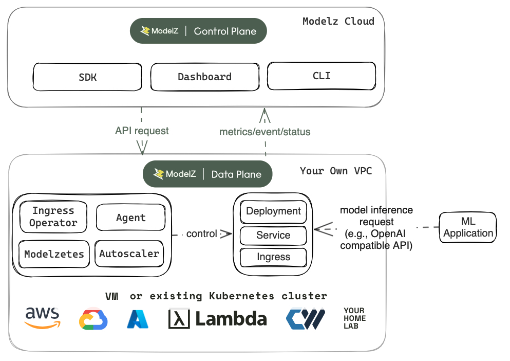

# BYOC Architecture

In this guide, we'll cover Bring Your Own Cloud(BYOC) feature in ModelZ, including its system architecture, agent, and security.

## Architecture

With BYOC, the data infrastructure, storage and network are owned by youself. We utilize a combination of your infrastructure and ModelZ hosted control plane service. You can deploy your machine learning models to any cluster (GCP, AWS, Lambda labs, your home lab, or even a single machine).There is no vendor lock and you can choose the most economical way to deploy models.

Let's see how it works:
- Firstly, You can refer to the [install document](./installation.mdx), install agent components.
- Once the agent is ready, developers can deploy models through the [ModelZ Console](../gettingstarted/deploy.mdx),[ModelZ CLI](../cli.mdx) or [ModelZ SDK](../sdk.mdx). 
- The ModelZ control plane, deployed outside of your private environment, interacts with the agent in your cluster, ensuring accurate and real-time state synchronization and updates according to the configurations defined.
- The data plane, deployed inside your private environment, resources related to the inference model will be created, such as deployment, service. If you want to expose your model deployment to the internet, it will create additional ingress for external access. 

## Agent
The agent components contain agent, Prometheus, Autoscaler, Modelzetes and IngressOperator, as a data plane it will be deployed in your private environment.

- Agent implements all the APIs used by the ModelZ control plane, it will periodically synchronize information and status. It will control the deployment, service and the ingress lifecycle. 

- Prometheus is used to collect metrics from the agent. All the requests to the agent, and the deployments will be recorded and exposed as metrics.

- Autoscaler is responsible for scaling the deployments. It will periodically pull the metrics from Prometheus and scale the deployments based on the metrics.

- Modelzetes is a Kubernetes operator that manages the deployments on Kubernetes runtime.

- Besides this, we will also have an ingress operator to provision endpoints for the deployments. It is not shown in the diagram.

## Security

With the rapid development of artificial intelligence, especially Generative AI, security and data protection remain the chief concerns for professionals in moving to the cloud.
- BYOC guarantees your models and request data remain within your VPC, thus ensuring your sensitive data never leaves your cluster. 
- What's more, we've open sourced all the code for the agent components, so you can learn about all the operations of the ModelZ control plane for your cluster! The github project repo is https://github.com/tensorchord/openmodelz.

