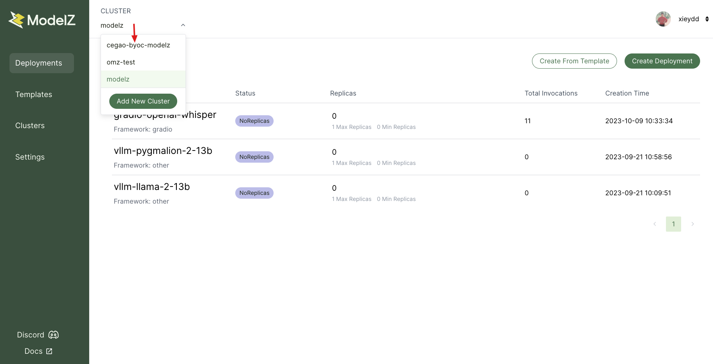

# Model Deployment

You can deploy your machine learning model service in the same way as our managed service [deploy](../gettingstarted/deploy.mdx). The only difference is that you need to switch the cluster from modelz to your own cluster name.
 