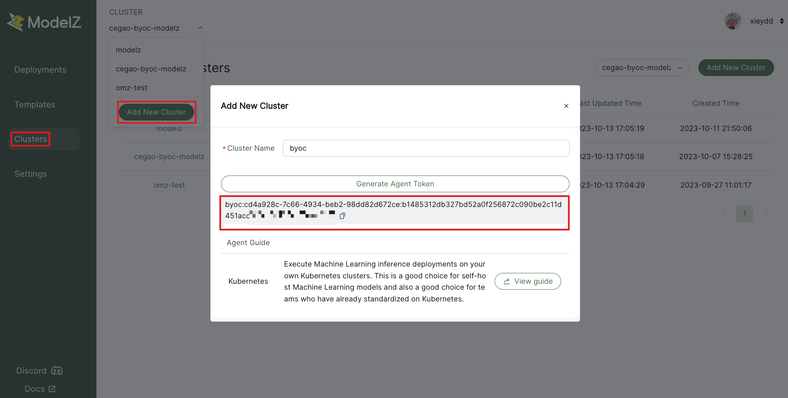
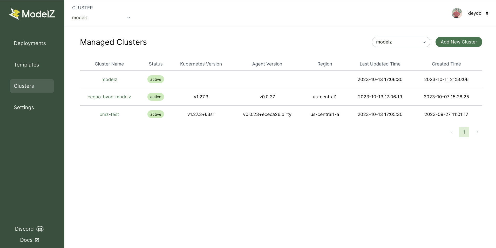

# BYOC Installation

We offer two installation methods, depending on whether or not you are connecting an existing kubernetes you maintain to ModelZ. Both are very simple and you can deploy in less than 1 minute! they all need agent token, you can get it from ModelZ dashboard.


## VM or Your Home Lab
### Preparation
```shell
$ pip install openmodelz
# Check install openmodelz correctly
$ mdz server start --help
Start the server with the public IP of the machine. If not provided, the internal IP will be used automatically.

Usage:
  mdz server start [flags]

Examples:
  mdz server start
  mdz server start -v
  mdz server start 1.2.3.4

Flags:
  -g, --force-gpu                          Start the server with GPU support (ignore the GPU detection)
  -h, --help                               help for start
      --mirror-endpoints https://quay.io   Mirror URL endpoints of the registry like https://quay.io
      --mirror-name string                 Mirror domain name of the registry (default "docker.io")
      --modelzcloud-agent-token string     ModelZ Cloud Agent Token
      --modelzcloud-enabled                Enable ModelZ Cloud Management
      --modelzcloud-region string          ModelZ Cloud Region (default "on-premises")
      --modelzcloud-url string             ModelZ Cloud URL (default "https://cloud.modelz.ai")

Global Flags:
      --debug               Enable debug logging
      --disable-telemetry   Disable anonymous telemetry
  -u, --url string          URL to use for the server (MDZ_URL) (default http://localhost:80)
  -v, --verbose             Verbose output
```

### Installation
```shell
$ mdz server start --modelzcloud-agent-token=byoc:cd4a928c-7c66-4934-beb2-98dd82d672ce:b1485312db327bd52a0f256872c090be2c11d451acc5f6ad9f473a181xxxxxx --modelzcloud-enabled=true --modelzcloud-region=us-central1-a 34.134.190.132
```
- `--modelzcloud-agent-token` is generated from ModelZ dashboard.
- `--modelzcloud-enabled` means enable ModelZ Cloud Management.
- `--modelzcloud-region=us-central1-a` is the region of your own VPC.
- `34.134.190.132` is the LoadBalancer IP for ingress nginx, it must be public IP to make sure accessible from the outside world. If you setup an instance VM in GCP, you can refer [reserve static external ip address](https://cloud.google.com/compute/docs/ip-addresses/reserve-static-external-ip-address).

You can check if the cluster is ready.
```shell
$mdz server list
NAME           PHASE  ALLOCATABLE     CAPACITY       
Ubuntu20.04    Ready  cpu: 2          cpu: 2         
               memory: 5.3GiB  memory: 5.3GiB 
```

If you want to add other VM as node of your cluster, you can refer this [document](https://docs.open.modelz.ai/).

## Existing Kubernetes
### Preparation
You need install [Helm CLI](https://helm.sh/docs/intro/install/).

### Installation
```shell
$ helm repo add modelz https://tensorchord.github.io/modelz-charts/
$ helm install \
--set gateway.modelzCloud.enabled=True \
--set gateway.modelzCloud.token=byoc:cd4a928c-7c66-4934-beb2-98dd82d672ce:b1485312db327bd52a0f256872c090be2c11d451acc5f6ad9f473a181xxxxxx \
modelz modelz/modelz
```
- `gateway.modelzCloud.enabled` means enable ModelZ Cloud Management.
- `gateway.modelzCloud.token` is generated from ModelZ dashboard.

You can check if the cluster is ready.
```shell
$ kubectl get pod
NAME                                         READY   STATUS    RESTARTS   AGE
autoscaler-778d5bcf4-kb9wn                   1/1     Running   0          13s
gateway-84bf688497-2pll7                     1/1     Running   0          13s
ingress-operator-5b45775955-9cfhs            1/1     Running   0          13s
modelz-kube-state-metrics-868559d899-cchlx   1/1     Running   0          13s
modelzetes-574999ff94-fhc5k                  1/1     Running   0          13s
prometheus-859bc89f79-9rr24                  1/1     Running   0          13s 
```

If you successfully installed using any of the above methods, you can see your own cluster status on the ModelZ control dashboard.


## Configuration your hardware
In order for the model to be deployed to the hardware you specify，you need configure the hardware requirements for your deployment. You need label every node in your cluster:
```
# VM
$ k3s kubectl label node Ubuntu20.04 ai.tensorchord.server-resource=cpu-1c-2g
# Existed kubernetes
$ kubectl label node Ubuntu20.04 ai.tensorchord.server-resource=cpu-1c-2g
```
**Notice**: Currently we only support two formats of hardware, `nvidia-tesla-t4-1-16g-4c-16g` and `cpu-4c-16g`.
- `nvidia-tesla-t4-1-16g-4c-16g`
    - `nvidia` is the GPU company(e.g., nvidia, amd).
    - `tesla` is the microarchitecture of GPU(e.g., tesla, volta, ampere).
    - `t4` is GPU model.
    - `1` means there is only one gpu card.
    - `16g` means gpu memory is 16GB.
    - `4c` means 6 cpu cores.
    - `16g` means cpu memory is 16GB.
- `cpu-4c-16g`
    - `4c` means 4 cpu cores.
    - `16g` means cpu memory 16GB.
