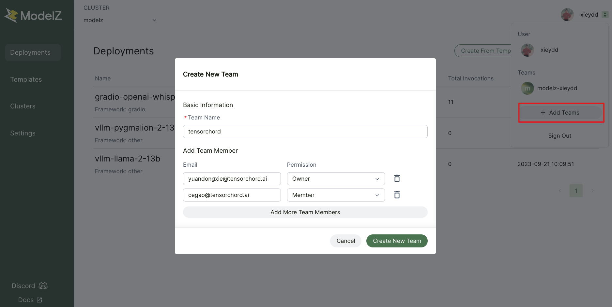
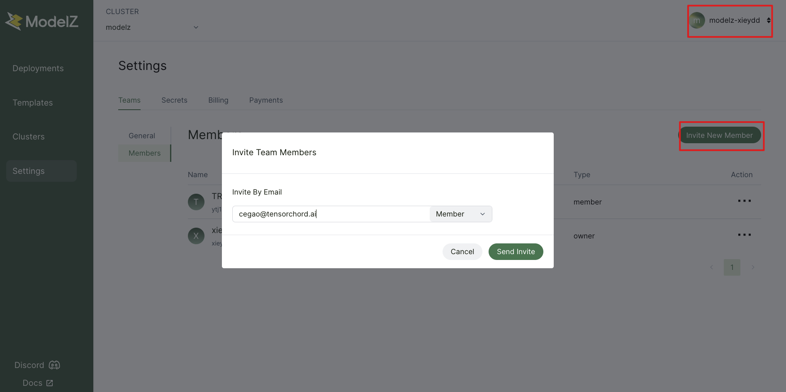
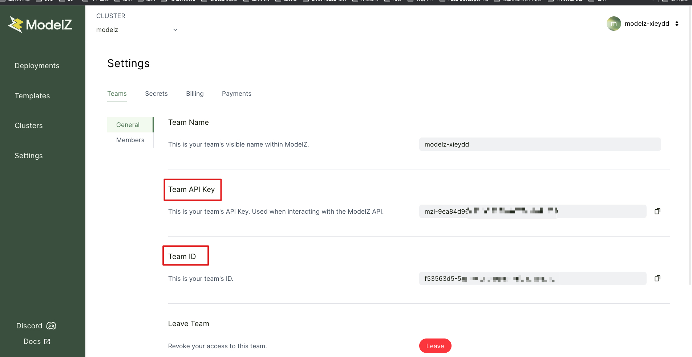

# Team Collaboration

After registering with ModelZ, you will automatically have a personal account that can run and deploy personal models. To collaborate with others, you can create or join a team.

## Create a Team

You can create a team, invite team members using their email addresses, and assign roles to them.
- If invited user of team is already signed up in ModelZ, the member will receive a team invitation by e-mail. After accepting the invitation, he can see the team in his team list.
- If email is not signed up in ModelZ, the invited user of team will receive a sign up email with invitation.

## Invite Team member

To invite a new team member, first switch your user setting to team.

## Team ID and APIKey

Each team has its own team ID and API key, which can be used by SDK or CLI for deployment control and endpoint access. They can be found in the following position.

## Role
Teams have two different role with different levels of access privileges:
- Owner
- Member
- Pending

The user that creates a team is automatically set as the Owner for that team. The owner can assign any other roles within the team, as well as pending other members of the workspace.

Member of a team can not assign any access privileges within the workspace but can perform actions like creating deployments and modifying Secrets.

Pending means the invited user not accept the invitation or the owner doesn't want the member to work on the team's resources anymore.

## Leave Team

To leave a team, navigate to the settings page and click `Leave` on a team.