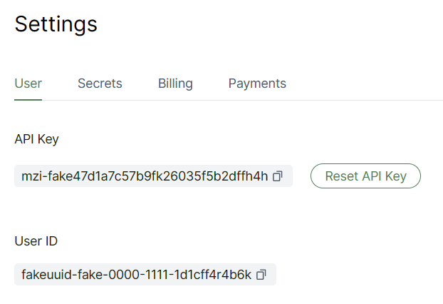
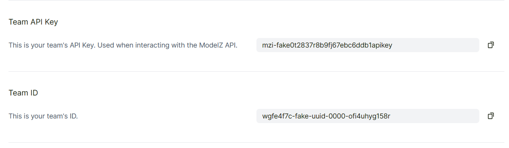

# Authentication

import { Callout } from 'nextra/components'

ModleZ supports two types of Authentication:
- by API Key
- by JWT token

## Method - API Key
You could get API Key from the [**API Keys**](https://cloud.modelz.ai/settings/user) page.


API Key is generated for a user or team. ModelZ use API key to access these operations:
- `create`, `list`, `update` or `delete` deployments
- make `inference` to deployment **without** WebUI([mosec](../frameworks/mosec))

For endpoint protected by API Key, you could pass it to request header as:
```json
{
    "X-API-KEY":"mzi-fake000generated111api222key"
}
```

<Callout type="warning">
  Deployments with WebUI([gradio](../frameworks/gradio), [streamlit](../frameworks/streamlit)...) is not protected by API Key, do not leak your endpoint of them!
</Callout>

These resources is more frequently to be accessed, and more possible to be integreted with downstream modules. 
Thus API Key should be fixed in main lifetime of your account, but you could regenerate it if the key leaks.

<Callout type="info">
  Team has its own API Key, which could be accessed by all members.
</Callout>


<Callout>
If you run ModelZ by BYOC, API Key is verified at your own cloud to reduce forward time.
</Callout>

## Method - JWT Token
Generated by GitHub login, ModelZ only verified JWT Token generated by GitHub.

JWT Token protects any private resource that is not managed by API Key, such as:
- User profile
- Team profile
- API Key

<Callout>
  You could not **generate** or **manage** JWT token, they are maintained by GitHub!
</Callout>

For endpoints protected by JWT Token, you could pass it at request header as:
```json
{
    "Authorization":"Bearer fakejwttoken..."
}
```
<Callout type="warning">
  If only recommend to use JWT Token by ModelZ WebUI. If you need other usage please [contact us](../community).
</Callout>

JWT token is used to protect resources less-often to be accessed, such as user info and usage.
As it's safer and less likely to leak, API Key is also protected by JWT token.

## Comparation of Authentication methods

|                       | API Key            | JWT Token  |
| :-------------------- | :----------------- | :--------- |
| Auth vender           | ModelZ             | GitHub     |
| Operation frequency   | Frequently         | Less-often |
| Operation caller      | SDK/OpenAPI client | WebUI      |
| Auth-failed fallback  | JWT Token          | /          |
| Verification location | Your Cloud/ModelZ  | ModelZ     |