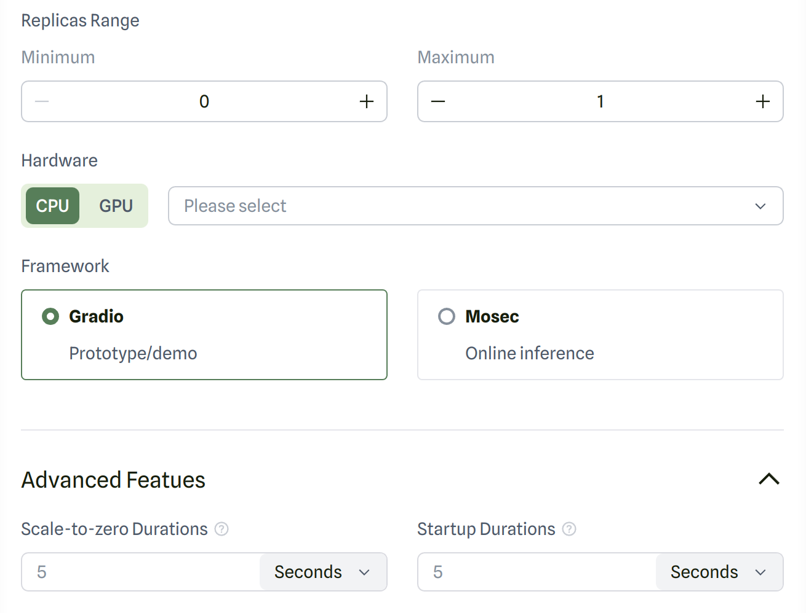

# Deployment

To deploy on Modelz, you need to create a **Deployment**, which is a containerized application that runs your inference code. You can deploy multiple deployments to the same cluster, and each deployment can have multiple replicas.

## Autoscaler

The autoscaler scales **Deployment** horizontally between a minimum and maximum number of replicas, or to zero.

You can configure the autoscaler to scale based on the number of concurrent requests. Configuration options are shown here:

- `min-replicas`: Minimum number of replicas to scale to. Defaults to 0.
- `max-replicas`: Maximum number of replicas to scale to. Defaults to 1.
- `target-load`: Ideal number of concurrent requests per replica. Defaults to 5.
- `scale-to-zero-duration`: Idle duration before scaling to zero. Defaults to 30 seconds.
- `startup-duration`: Duration to wait for the deployment to start up. Defaults to 10 minutes.

### Examples

Let's say `min_replicas` is 0, `max_replicas` is 2, and `target_load` is 5. This means that you have a model that can handle 5 concurrent requests per replica. 

The replicas will be 0 when there are no requests, and will scale up to 1 when there are 1 concurrent requests. If there are 6 concurrent requests, the replicas will scale up to 2. And after 30 seconds of no requests, the replicas will scale down to 0.

## Hardware

You can configure the hardware requirements for your deployment. Currently, we provide two options:

- `cpu-4c-16g`: CPU instance with 4 cores and 16GB of memory.
- `nvidia-t4-4c-16g`: GPU instance with 4 cores, 16GB of memory, and a NVIDIA T4 GPU.
- `nvidia-ampere-a100-40g-12c-85g`: GPU instance with 12 cores, 85GB of memory, and a NVIDIA A100 GPU (40GB).
