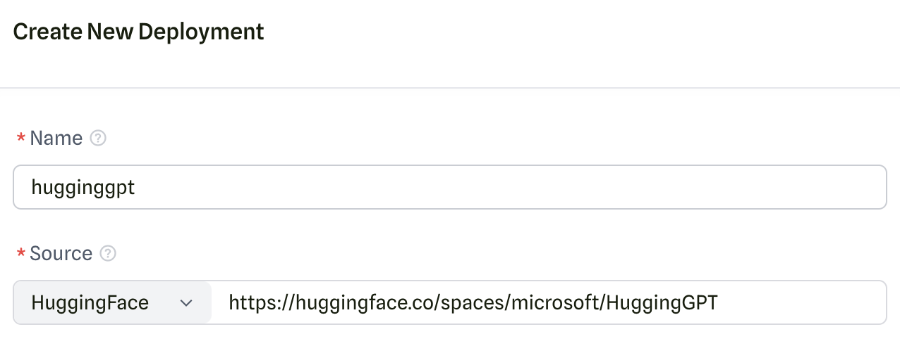
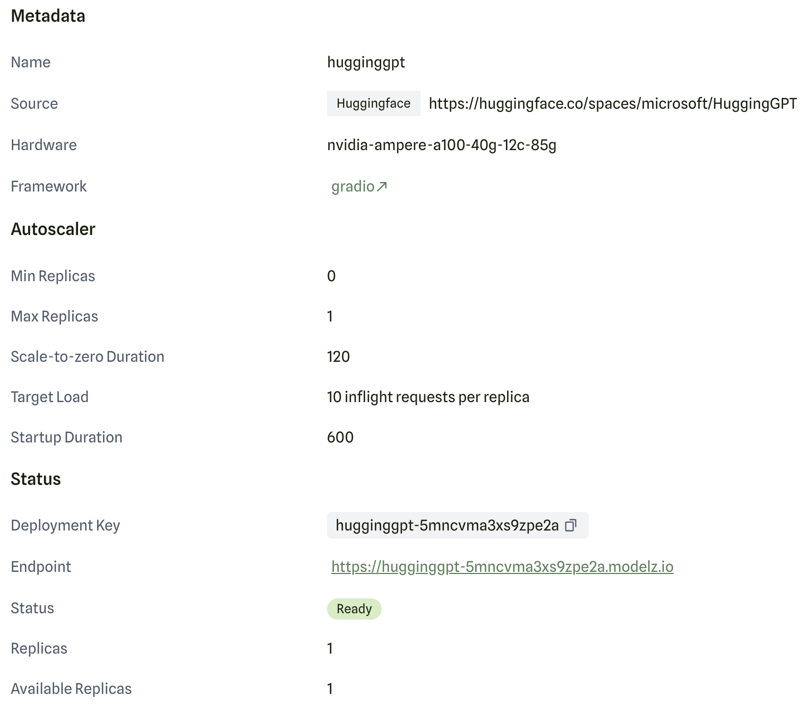
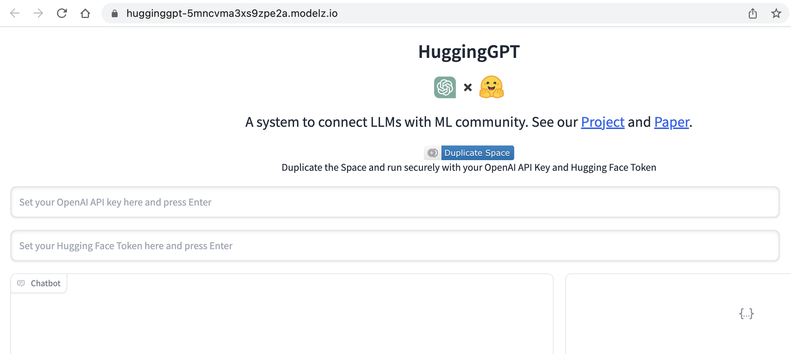

# From Huggingface Space

You could deploy the gradio application from huggingface space. You could use the full URL of the huggingface space (e.g. [`https://huggingface.co/spaces/microsoft/HuggingGPT`](https://huggingface.co/spaces/microsoft/HuggingGPT)) or the space name (e.g. `microsoft/HuggingGPT`) in the `Source` field.

After you have successfully deployed your inference deployment, you could visit the detail page to get the endpoint URL:

You could use the endpoint URL (`https://hugginggpt-5mncvma3xs9zpe2a.modelz.io/` in this case) to use HuggingGPT.

After a idle period, the deployment will be scaled down to 0 replicas. You could visit the detail page to see the current number of replicas. Another request will trigger the deployment to scale up again.
