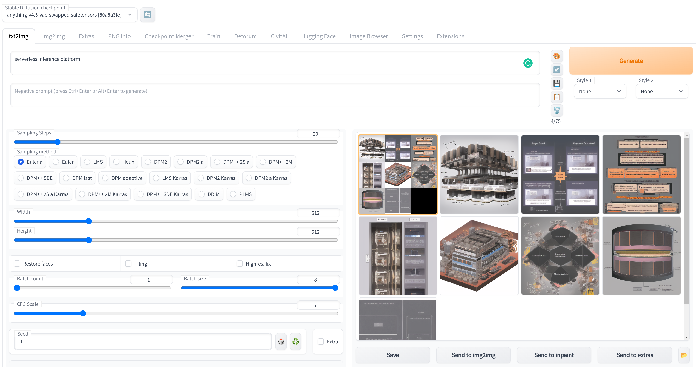

# Stable Diffusion

import { DeployButton } from 'components/deployButton'

<DeployButton style={{marginTop: '12px'}} link='https://cloud.modelz.ai/deployment/template?templateId=993edd4b-4f3a-4560-bad3-b20954f95335'/>

[Stable Diffusion](https://github.com/Stability-AI/stablediffusion) is a latent text-to-image diffusion model capable of generating photo-realistic images given any text input.

We provide the [**Gradio**](../gradio) app based on [AUTOMATIC1111/stable-diffusion-webui](https://github.com/AUTOMATIC1111/stable-diffusion-webui), and the inference server template [modelz-template-stable-diffusion](https://github.com/tensorchord/modelz-template-mosec).

## Gradio

You could deploy our pre-built Gradio app [here](https://cloud.modelz.ai/deployment/template) if you want to quickly try out Stable Diffusion.

You could use the pre-built docker image [modelzai/gradio-stable-diffusion:23.03](https://hub.docker.com/layers/modelzai/gradio-stable-diffusion/23.03/images/sha256-45529c4783f716fd30d16ea054718286c14f0cc289bc6cc4a7057269eaace430?context=repo) to deploy the app.
