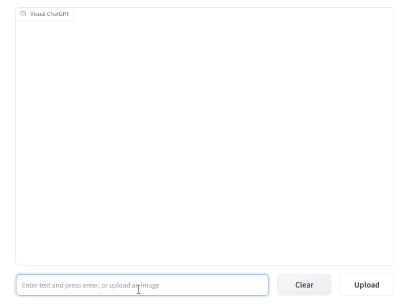

# Visual ChatGPT

[Visual ChatGPT](https://github.com/microsoft/visual-chatgpt) connects ChatGPT and a series of Visual Foundation Models to enable sending and receiving images during chatting. The model is open sourced by Microsoft.

## Gradio

You could deploy our pre-built Gradio app [here](https://cloud.modelz.ai/deployment/template) if you want to quickly try out Visual ChatGPT.

import {Callout } from 'nextra-theme-docs'

<Callout emoji="🚀">
Please add the environment variable `OPENAI_API_KEY` to your deployment.
</Callout>

import Image from 'next/image'
import detail from './images/visual-chatgpt.png'

<Image src={detail} alt="Visual ChatGPT template" width={500} height={1000} />
