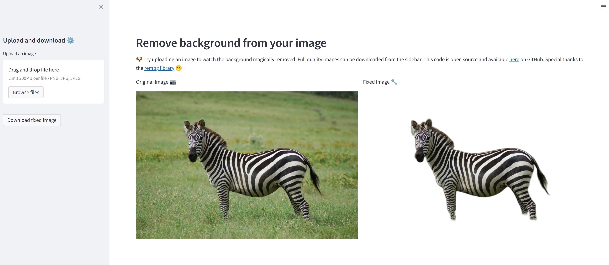

# Background Removal

[BackgroundRemoval](https://github.com/tyler-simons/BackgroundRemoval) Allows users to remove the background from images.

You could use the template [here](https://cloud.modelz.ai/deployment/template) to deploy your personal instance.

import {Callout } from 'nextra-theme-docs'

<Callout emoji="🚀">
You could use CPU for this template.
</Callout>

import { DeployButton } from 'components/deployButton'

<DeployButton style={{marginTop: '12px'}} link='https://cloud.modelz.ai/deployment/template?templateId=80612506-935c-4279-9651-deb02fbaee89'/>
