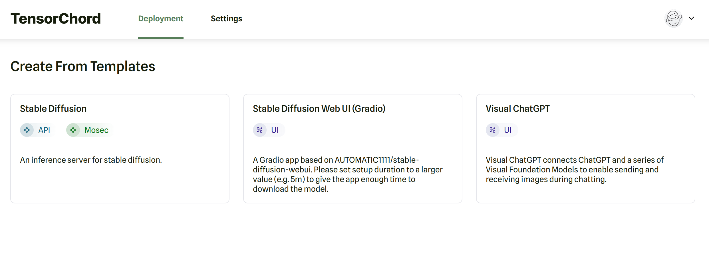
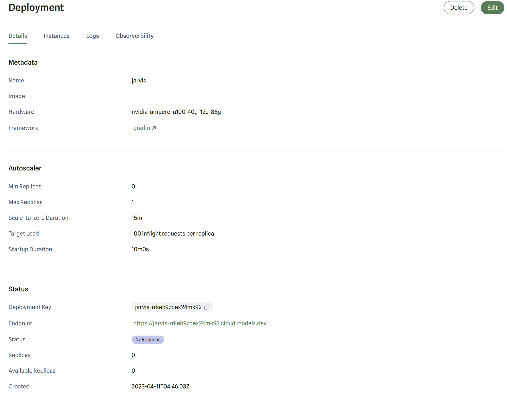

# Deploy

Modelz is an end-to-end platform for developers, that allows you to create and deploy your models to the cloud in just a few minutes.

## Sign up

To sign up for Modelz, go to https://cloud.modelz.ai/signup. You can choose to authenticate either with GitHub or by using an email. When using email authentication, you may need to confirm both your email address and a phone number.

## Create & deploy a Deployment

Once you have successfully signed up for Modelz, you're ready to start creating a deployment.

A [**Deployment**](../concepts/deployment) is the place where you write your prediction code and deploy it to the cloud. When you visit the dashboard, you'll see a list of all your inference deployments. There are two ways to create a new deployment on Modelz:

- **Use a [Template](../templates).** You could use one of our templates to get started with your deployment.
- **Build and deploy a new deployment from scratch**. You could visit the [**Build**](../deployments/build) page to learn how to build a new inference server and push it to a Docker Registry.

### Use a Template

Modelz provides a set of pre-built templates that you could use to get started with your deployment. You could visit [cloud.modelz.ai/deployment/template](http://cloud.modelz.ai/deployment/template) to get all public templates.

You could click on the template to use it. You'll be redirected to the deployment create page, where you could configure your deployment.

## Configure your Deployment

Whenever you create a new inference deployment on Modelz, the platform will try to preselect the right default configuration for you.

import { Tab, Tabs } from 'nextra-theme-docs'
import Image from 'next/image'
import mosecDemo from './images/mosec-demo.png'
import gradioDemo from './images/gradio-demo.png'
 
<Tabs items={['huggingface space', 'docker']}>
  <Tab>
    You could deploy the gradio application from huggingface space. You could use the full URL of the huggingface space (e.g. <code>https://huggingface.co/spaces/project-baize/Baize-7B</code>) or the space name (e.g. <code>project-baize/Baize-7B</code>) in the <code>Source</code> field.

    <Image src={gradioDemo} alt="Deployment Configuration" width={500} height={1000} />
  </Tab>
  <Tab>
    You could also deploy gradio or mosec applications from docker registry. You could use the full URL of the docker registry (e.g. <code>modelzai/mosec-stable-duffsion:23.02</code>) in the <code>Source</code> field.

    <Image src={mosecDemo} alt="Deployment Configuration" width={500} height={1000} />
  </Tab>
</Tabs>

### Autoscaling

Currently, Modelz supports autoscaling based on inflight requests. This means that you can configure your inference deployment to scale up or down based on the number of requests that are currently being processed.

You could configure a minimum and maximum number of replicas for your inference deployment. For example, if you set the minimum number of replicas to 1 and the maximum number of replicas to 10, then Modelz will make sure that your inference deployment always has at least 1 replica running, and at most 10 replicas running.

For more information about autoscaling, you could visit the [**Autoscaler**](../concepts/deployment#autoscaler) page.

## Get your Deployment URL

Once you have successfully deployed your inference deployment, you could visit the detail page to get the endpoint URL:

You could visit the web UI by clicking on the URL if the deployment is based on [**Gradio**](../frameworks/gradio).

## Make predictions

Or you could use the URL to make predictions. You can visit the [**Make Predictions**](./inference) page to learn how to use your deployed inference deployment.
