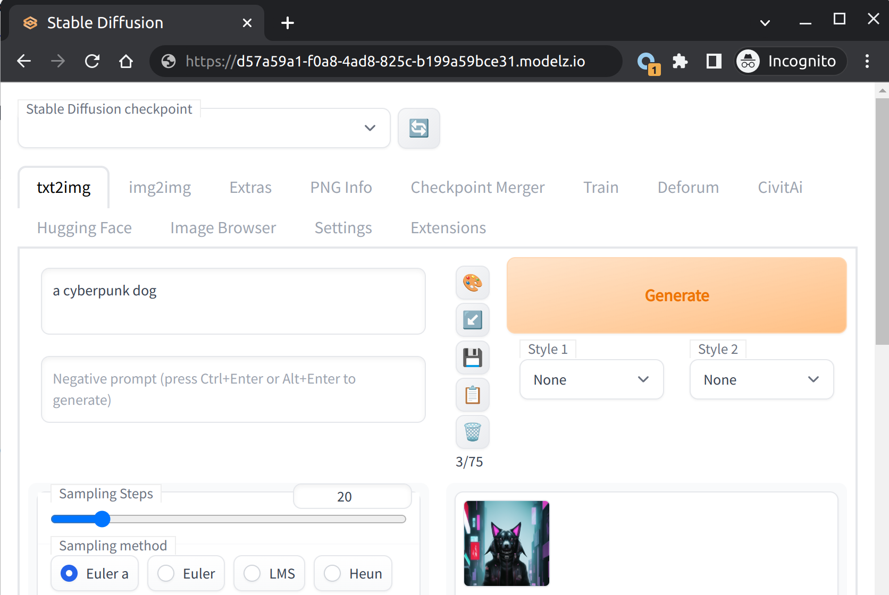

# Introduction to Modelz

Modelz is a developer-first platform for prototyping and deploying machine learning models. With our dashboard and APIs, developers can easily bring their ML ideas to life without worrying about the hassle of infrastructure setup or maintenance.

## Why use Modelz

Modelz provides the following features out-of-the-box:

- **Serverless**: Serverless architecture enables us to easily scale up or down according to your needs, allowing us to provide a reliable and scalable solution for deploying and prototyping machine learning applications at any scale.
- **Reduce cost**: Just pay for what you use. No more paying for cold starts and idle servers. **Plus**, get 1 GPU hour free on us when you join.
- **OpenAI compatible API**: Our platform supports OpenAI compatible API, which means you can easily integrate new open source LLMs into your existing applications with just a few lines of code.
- **Prototyping environment**: We provide a robust prototyping environment with support for [**Gradio**](./frameworks/gradio) and [**Streamlit**](./frameworks/streamlit). With our integration with HuggingFace Space, accessing pre-trained models and launching demos is easier than ever, with just one click. This allows you to quickly test and iterate on your models, saving you time and effort in the development process.

## Deploy your first model in 3 minutes

import {Callout, Bleed } from 'nextra-theme-docs'

<Callout emoji="🚀">
Take the following walkthrough to get started:
</Callout>

<iframe width="100%" height="500" src="https://www.youtube.com/embed/N0rtw3Q3-hc" title="YouTube video player" frameBorder="0" allow="accelerometer; autoplay; clipboard-write; encrypted-media; gyroscope; picture-in-picture; web-share" allowFullScreen></iframe>

- [Sign up](https://forms.gle/pqhGRv8iwTRF3TsY7): Head to our website and sign up for a free account. Once you've signed up, you'll be able to access our platform and start deploying and prototyping machine learning models. You will get 1 free GPU hour on us.
- Deploy your first model on Modelz. You could use our [**templates**](./templates). Modelz's serverless architecture means you don't need to worry about managing or scaling infrastructure - we take care of that for you.

  <Cards>
  <Card icon={<svg xmlns="http://www.w3.org/2000/svg" fill="none" viewBox="0 0 24 24" strokeWidth={1.5} stroke="currentColor" className="w-6 h-6">
  <path strokeLinecap="round" strokeLinejoin="round" d="M9.813 15.904L9 18.75l-.813-2.846a4.5 4.5 0 00-3.09-3.09L2.25 12l2.846-.813a4.5 4.5 0 003.09-3.09L9 5.25l.813 2.846a4.5 4.5 0 003.09 3.09L15.75 12l-2.846.813a4.5 4.5 0 00-3.09 3.09zM18.259 8.715L18 9.75l-.259-1.035a3.375 3.375 0 00-2.455-2.456L14.25 6l1.036-.259a3.375 3.375 0 002.455-2.456L18 2.25l.259 1.035a3.375 3.375 0 002.456 2.456L21.75 6l-1.035.259a3.375 3.375 0 00-2.456 2.456zM16.894 20.567L16.5 21.75l-.394-1.183a2.25 2.25 0 00-1.423-1.423L13.5 18.75l1.183-.394a2.25 2.25 0 001.423-1.423l.394-1.183.394 1.183a2.25 2.25 0 001.423 1.423l1.183.394-1.183.394a2.25 2.25 0 00-1.423 1.423z" /></svg>} title="Gradio - Stable Diffusion" href="/frameworks/gradio/stable-diffusion"/>
  <Card icon={<svg xmlns="http://www.w3.org/2000/svg" fill="none" viewBox="0 0 24 24" strokeWidth={1.5} stroke="currentColor" className="w-6 h-6">
  <path strokeLinecap="round" strokeLinejoin="round" d="M9.813 15.904L9 18.75l-.813-2.846a4.5 4.5 0 00-3.09-3.09L2.25 12l2.846-.813a4.5 4.5 0 003.09-3.09L9 5.25l.813 2.846a4.5 4.5 0 003.09 3.09L15.75 12l-2.846.813a4.5 4.5 0 00-3.09 3.09zM18.259 8.715L18 9.75l-.259-1.035a3.375 3.375 0 00-2.455-2.456L14.25 6l1.036-.259a3.375 3.375 0 002.455-2.456L18 2.25l.259 1.035a3.375 3.375 0 002.456 2.456L21.75 6l-1.035.259a3.375 3.375 0 00-2.456 2.456zM16.894 20.567L16.5 21.75l-.394-1.183a2.25 2.25 0 00-1.423-1.423L13.5 18.75l1.183-.394a2.25 2.25 0 001.423-1.423l.394-1.183.394 1.183a2.25 2.25 0 001.423 1.423l1.183.394-1.183.394a2.25 2.25 0 00-1.423 1.423z" /></svg>} title="Gradio - HuggingGPT" href="/frameworks/gradio/hugginggpt"/>
  <Card icon={<svg xmlns="http://www.w3.org/2000/svg" fill="none" viewBox="0 0 24 24" strokeWidth={1.5} stroke="currentColor" className="w-6 h-6">
  <path strokeLinecap="round" strokeLinejoin="round" d="M9.813 15.904L9 18.75l-.813-2.846a4.5 4.5 0 00-3.09-3.09L2.25 12l2.846-.813a4.5 4.5 0 003.09-3.09L9 5.25l.813 2.846a4.5 4.5 0 003.09 3.09L15.75 12l-2.846.813a4.5 4.5 0 00-3.09 3.09zM18.259 8.715L18 9.75l-.259-1.035a3.375 3.375 0 00-2.455-2.456L14.25 6l1.036-.259a3.375 3.375 0 002.455-2.456L18 2.25l.259 1.035a3.375 3.375 0 002.456 2.456L21.75 6l-1.035.259a3.375 3.375 0 00-2.456 2.456zM16.894 20.567L16.5 21.75l-.394-1.183a2.25 2.25 0 00-1.423-1.423L13.5 18.75l1.183-.394a2.25 2.25 0 001.423-1.423l.394-1.183.394 1.183a2.25 2.25 0 001.423 1.423l1.183.394-1.183.394a2.25 2.25 0 00-1.423 1.423z" /></svg>} title="Gradio - StableLM" href="/frameworks/gradio/stablelm"/>
  <Card icon={<svg xmlns="http://www.w3.org/2000/svg" fill="none" viewBox="0 0 24 24" strokeWidth={1.5} stroke="currentColor" className="w-6 h-6">
  <path strokeLinecap="round" strokeLinejoin="round" d="M9.813 15.904L9 18.75l-.813-2.846a4.5 4.5 0 00-3.09-3.09L2.25 12l2.846-.813a4.5 4.5 0 003.09-3.09L9 5.25l.813 2.846a4.5 4.5 0 003.09 3.09L15.75 12l-2.846.813a4.5 4.5 0 00-3.09 3.09zM18.259 8.715L18 9.75l-.259-1.035a3.375 3.375 0 00-2.455-2.456L14.25 6l1.036-.259a3.375 3.375 0 002.455-2.456L18 2.25l.259 1.035a3.375 3.375 0 002.456 2.456L21.75 6l-1.035.259a3.375 3.375 0 00-2.456 2.456zM16.894 20.567L16.5 21.75l-.394-1.183a2.25 2.25 0 00-1.423-1.423L13.5 18.75l1.183-.394a2.25 2.25 0 001.423-1.423l.394-1.183.394 1.183a2.25 2.25 0 001.423 1.423l1.183.394-1.183.394a2.25 2.25 0 00-1.423 1.423z" /></svg>} title="Gradio - Visual ChatGPT" href="/frameworks/gradio/visual-chatgpt"/>
  </Cards>

  Or you could launch demos from Huggingface Space in one click. Get the URL of the demo and paste it in the Modelz platform.

  <Cards>
  <Card icon={<svg xmlns="http://www.w3.org/2000/svg" fill="none" viewBox="0 0 24 24" strokeWidth={1.5} stroke="currentColor" className="w-6 h-6">
  <path strokeLinecap="round" strokeLinejoin="round" d="M9.813 15.904L9 18.75l-.813-2.846a4.5 4.5 0 00-3.09-3.09L2.25 12l2.846-.813a4.5 4.5 0 003.09-3.09L9 5.25l.813 2.846a4.5 4.5 0 003.09 3.09L15.75 12l-2.846.813a4.5 4.5 0 00-3.09 3.09zM18.259 8.715L18 9.75l-.259-1.035a3.375 3.375 0 00-2.455-2.456L14.25 6l1.036-.259a3.375 3.375 0 002.455-2.456L18 2.25l.259 1.035a3.375 3.375 0 002.456 2.456L21.75 6l-1.035.259a3.375 3.375 0 00-2.456 2.456zM16.894 20.567L16.5 21.75l-.394-1.183a2.25 2.25 0 00-1.423-1.423L13.5 18.75l1.183-.394a2.25 2.25 0 001.423-1.423l.394-1.183.394 1.183a2.25 2.25 0 001.423 1.423l1.183.394-1.183.394a2.25 2.25 0 00-1.423 1.423z" /></svg>} title="Gradio - From Huggingface Space" href="/frameworks/gradio/huggingface-space"/>
  </Cards>

- Once your model is ready, feel free to start using it! If you deployed a model with [**Gradio**](./frameworks/gradio), you could access it by the URL `https://<deployment-id>.modelz.io` provided in the deployment page.

  

  If you are using [**Mosec**](./frameworks/mosec), you could use the [**SDK**](./sdk) and API key to access the model.

  ```python copy
  # pip install modelz-py
  import modelz

  APIKey = "mzi-abcdefg..."

  cli = modelz.ModelzClient(key=APIKey, deployment="abcdgefg...")
  cli.inference(params={}, timeout=10)
  ```

  Or alternatively, you could use the `curl`.

  ```bash copy
  curl --location 'https://{DEPLOYMENT_ID}.modelz.io/inference' \
  --header 'Content-Type: application/json' \
  --header 'X-API-Key: mzi-abcdefg...' \
  --data '{
      ...
  }'
  ```

## Getting started

To get started with Modelz, you could check out the following resources:

import { Card, Cards } from 'nextra-theme-docs'

<Cards>
  <Card icon={<svg xmlns="http://www.w3.org/2000/svg" fill="none" viewBox="0 0 24 24" strokeWidth={1.5} stroke="currentColor" className="w-6 h-6">
  <path strokeLinecap="round" strokeLinejoin="round" d="M9.813 15.904L9 18.75l-.813-2.846a4.5 4.5 0 00-3.09-3.09L2.25 12l2.846-.813a4.5 4.5 0 003.09-3.09L9 5.25l.813 2.846a4.5 4.5 0 003.09 3.09L15.75 12l-2.846.813a4.5 4.5 0 00-3.09 3.09zM18.259 8.715L18 9.75l-.259-1.035a3.375 3.375 0 00-2.455-2.456L14.25 6l1.036-.259a3.375 3.375 0 002.455-2.456L18 2.25l.259 1.035a3.375 3.375 0 002.456 2.456L21.75 6l-1.035.259a3.375 3.375 0 00-2.456 2.456zM16.894 20.567L16.5 21.75l-.394-1.183a2.25 2.25 0 00-1.423-1.423L13.5 18.75l1.183-.394a2.25 2.25 0 001.423-1.423l.394-1.183.394 1.183a2.25 2.25 0 001.423 1.423l1.183.394-1.183.394a2.25 2.25 0 00-1.423 1.423z" />
</svg>
} title="Getting Started - How to deploy" href="/gettingstarted/deploy"/>
</Cards>
