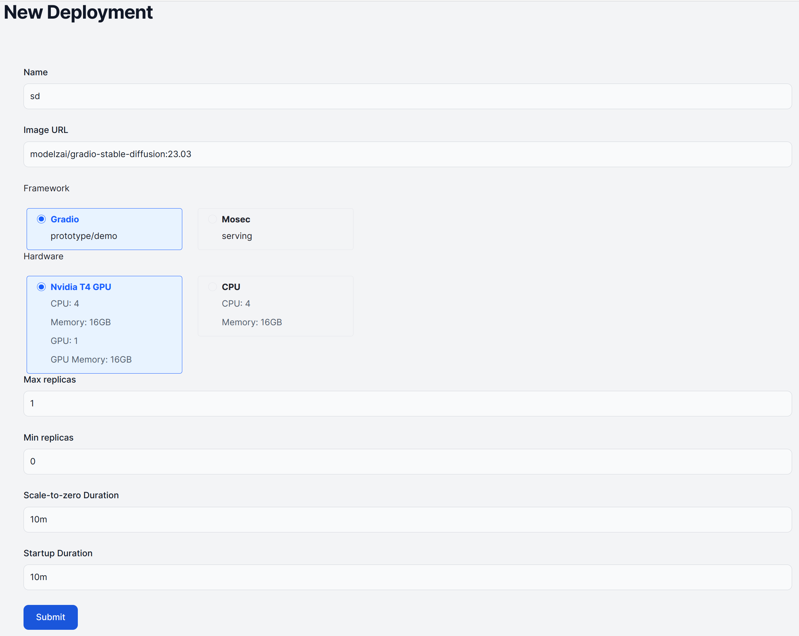

# Stable Diffusion

[Stable Diffusion](https://github.com/Stability-AI/stablediffusion) is a latent text-to-image diffusion model capable of generating photo-realistic images given any text input.


We provide the [**Gradio**](../frameworks/gradio) app based on [AUTOMATIC1111/stable-diffusion-webui](https://github.com/AUTOMATIC1111/stable-diffusion-webui), and the inference server template [modelz-template-stable-diffusion](https://github.com/tensorchord/modelz-template-mosec).

## Gradio

You could deploy our pre-built Gradio app to Modelz if you want to quickly try out Stable Diffusion.


You could use the pre-built docker image [modelzai/gradio-stable-diffusion:23.03](https://hub.docker.com/layers/modelzai/gradio-stable-diffusion/23.03/images/sha256-45529c4783f716fd30d16ea054718286c14f0cc289bc6cc4a7057269eaace430?context=repo) to deploy the app.



## Mosec

You could deploy the inference server template then use our [**SDK**](../sdk) to make predictions.

```python copy
# pip install modelz-py
import modelz

apiKey = "mzi-abcdefg..."

cli = modelz.ModelzClient(api_key=apiKey, project="abcdgefg...")
cli.inference(params={
    "text": "A dog is running in the grass."
}, timeout=10)
```

You could use the pre-built docker image [modelzai/mosec-stable-diffusion:23.03]() to deploy the app.
