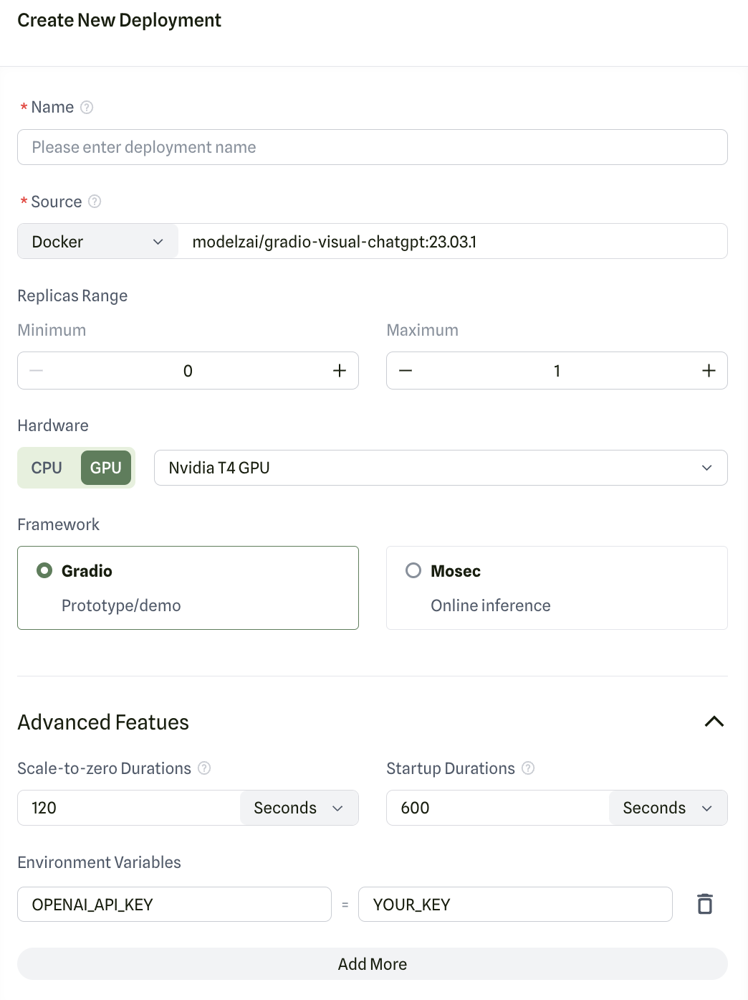

# Visual ChatGPT

[Visual ChatGPT](https://github.com/microsoft/visual-chatgpt) connects ChatGPT and a series of Visual Foundation Models to enable sending and receiving images during chatting. The model is open sourced by Microsoft.

## Gradio

You could deploy our pre-built Gradio app to Modelz if you want to quickly try out Visual ChatGPT.

Please use the pre-built image [modelzai/gradio-visual-chatgpt:23.03](https://hub.docker.com/layers/modelzai/gradio-visual-chatgpt/23.03/images/sha256-124e4c8352a28f9d6a337e69e2191c379a40d1bea612553f25c2a3cf2aa4f298?context=repo) to deploy the app. `OPENAI_API_KEY` is required as an environment variable. You could get it from OpenAI.
